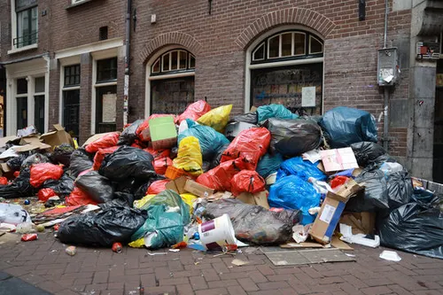
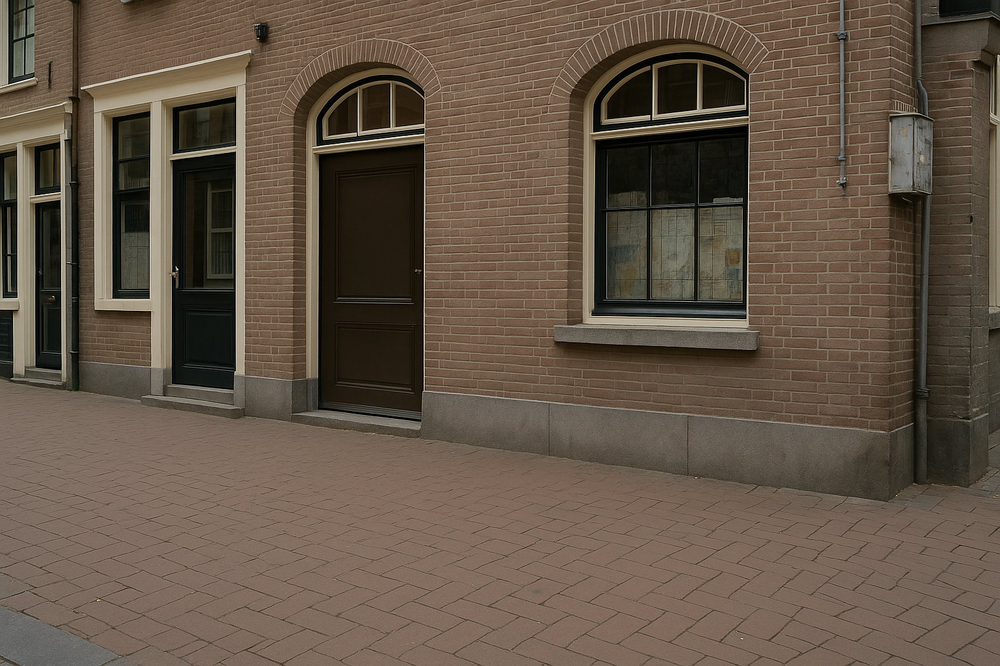

# Ecoquest

Ecoquest is an environmental project aimed at identifying and categorizing garbage using machine learning models. This project helps in promoting cleanliness and sustainability by providing an automated way to detect and report garbage.

## Features
- Garbage detection using trained models.
- Categorization of waste for better management.
- Easy-to-use interface for testing and reporting.

## Setup
1. Clone the repository:
    ```bash
    git clone https://github.com/your-repo/Ecoquest.git
    ```
2. Navigate to the project directory:
    ```bash
    cd Ecoquest
    ```
3. Install the required dependencies:
    ```bash
    npm install
    ```
4. Run the application:
    ```bash
    npm  run dev
    ```

## Usage
1. Use the provided sample images to test the project:
    - **Garbage Report**: Use `mesh.webp` to test garbage detection.
    - **Model Check**: Use `clean.png` to verify the model's functionality.
2. Upload the images through the application interface and view the results.

## Sample Images
### Garbage Report


### Model Check


## Contributing
Contributions are welcome! Please fork the repository and submit a pull request.

## License
This project is licensed under the MIT License. See the `LICENSE` file for details.